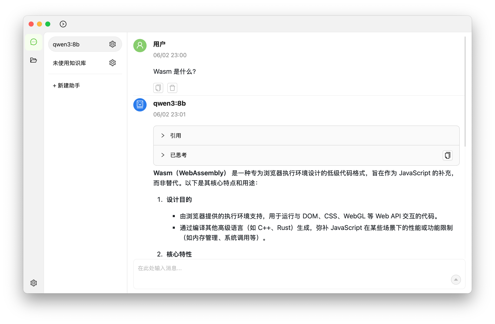

# Local Mind

## 简介

个人毕设项目。使用 Tauri 实现了一个本地的知识库客户端软件。

项目 Wiki（由 DeepWiki 生成）：https://deepwiki.com/CakeAL/local-mind/

如果此项目对您有帮助的话，可以点一个 Star 以表达您的支持。

## 架构图


## 下载链接

详见右侧Release

## 运行截图



## 开发

首先确保你已经安装了[`Deno`](https://deno.com)，以及[`Rust环境`](https://www.rust-lang.org/zh-CN/tools/install)

```bash
# 安装 create-tauri-app
cargo install create-tauri-app --locked
# 安装tauri 命令行 https://tauri.app/zh-cn/blog/2022/09/15/tauri-1-1/#cargo-binstall-support-for-tauri-cli
cargo install tauri-cli --version "^2.0.0" --locked
# 运行
# 如果安装了 just
just d
# 或者
cargo tauri dev
# 或者
deno install
deno task tauri dev
```

## 构建

```bash
# 如果安装了 just
just b
# 或者
cargo tauri build
# 或者
deno task tauri build
```
